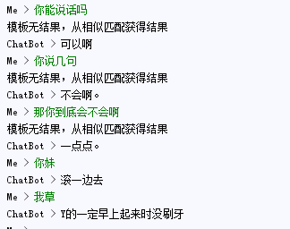

## 基于相似问法的闲聊场景对话机器人（Version 2）

---
## ChatBot运行步骤：  

Step 1. 在根目录下新建corpus文件夹，将[语料文件][1]下载并解压到corpus文件夹 (密码：0n2x)

Step 2. 在根目录下新建model文件夹，将训练好的[词向量文件][2]下载并解压到model文件夹 (egg9)  

Step 3. 运行getQA.py获得所需的运行文件，这里已经有训练好的_词向量模型_，所以getQA运行时会  
直接加载，并获得chat所需的所有文件。  

Step 4. 运行chat.py进行问答测试  

> 几种对话匹配策略
> - aiml 自定义对话模板  
> - vectorMatcher 句子词向量加权表示的余弦相似度
> - levenshteinMatcher 编辑距离匹配
> - BM-25 相似匹配(暂未使用)

---

## 对话结果  

  

<-old version->

#### 与Version 1的不同

- 扩充了机器人的语料库（闲谈逸致,文理类,生活相关,职场职业,城市问题,教育类,情感类,旅游景点,电影,考试相关,名人巨星,生活常识,歌曲歌词,国家相关）

---

> 2017/09/07 <-new version->
> 将相似匹配算法移到了matcher
> 增加了BM-25匹配算法
---
[1]:http://pan.baidu.com/s/1kVFwrpP
[2]:http://pan.baidu.com/s/1dFzZxc9
